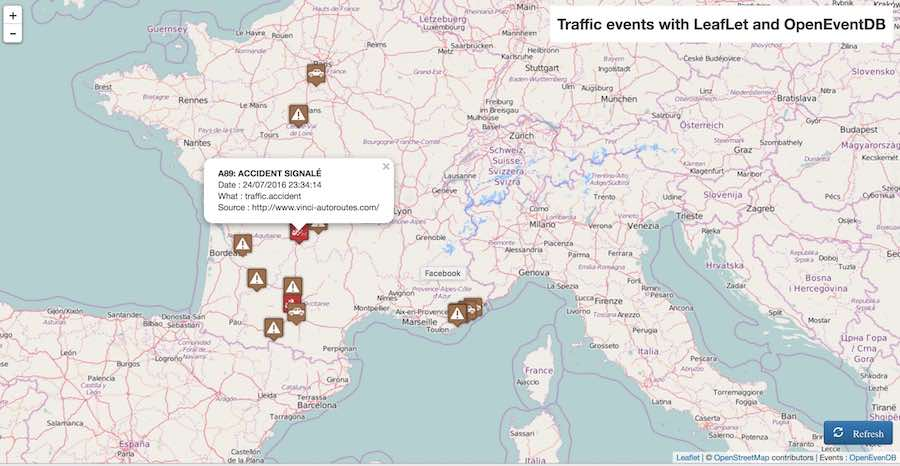

# Simple trafic map with LeafLet and OpenEventDB



This sample shows how to make an interactive map that represents live traffic map.

Events are requested from OEBD by a simple ajax request with params : 
* what=trafic
* when=last1hours
* bbox=[...])

See demo <a href="http://heroteknik.ovh/viz/paris-fellow-oedb-front-traffic/">here</a>.

## Code

###Init map

```javascript
function init() {
	
	var osmUrl = 'http://{s}.tile.openstreetmap.org/{z}/{x}/{y}.png',
		osmAttrib = '&copy; <a href="http://openstreetmap.org/copyright">OpenStreetMap</a> contributors&nbsp;|&nbsp;Events : <a href="https://github.com/openeventdatabase/backend/wiki">OpenEvenDB</a>',
		osm = L.tileLayer(osmUrl, {maxZoom: 18, attribution: osmAttrib});
	map = new L.Map('map', {layers: [osm], center: new L.LatLng(46.9886, 2.08740), zoom: 6 });
	
	var legend = L.control({position: 'bottomright'});

	legend.onAdd = function (map) {
	    var div = L.DomUtil.create('div', 'info legend');

		div.innerHTML = '<div id="refreshDv"><button type="button" onclick="showTrafficEvents()" class="btn btn-primary" aria-label="Left Align">' + 
						'<span class="glyphicon glyphicon-refresh" aria-hidden="true">&nbsp;Refresh</span>' + 
						'</button></div>';
	
	    return div;
	};
	
	var title = L.control({position: 'topright'});

	title.onAdd = function (map) {
	    var div = L.DomUtil.create('div', 'info title');
		div.innerHTML = 'Traffic events with LeafLet and OpenEventDB';
	    return div;
	};
					
	legend.addTo(map);
	title.addTo(map);
	
	showTrafficEvents();
	
};
			
```
###Showing traffic events

```javascript
function showTrafficEvents() {
	geojsonLayer.clearLayers();
	
	var endpoint="http://api.openeventdatabase.org/event?";
	var box = [map.getBounds()._northEast.lng,map.getBounds()._southWest.lat,map.getBounds()._southWest.lng,map.getBounds()._northEast.lat];
	var bbox = box.join(",");
	
	var reqDatas =  jQuery.param({
		"what": "traffic", 
		"when":"last1hours",
		"bbox":bbox 
	});
		
	$.ajax({
		headers: {},
        url : endpoint,
        data: decodeURIComponent(reqDatas),
        dataType : 'json'
    }).done(function(events) {
		console.log( events);
		geojsonLayer = L.geoJson(events, {
		    pointToLayer: pointToLayer
		}).addTo(map);
		
		
	});
	
	function pointToLayer(feature, latlng) {

		var icon =  L.icon();
		var iconDefault =  L.icon({ iconUrl: './mapicons-collection/car.png', iconSize:[32, 37]});
		var iconAccident =  L.icon({ iconUrl: './mapicons-collection/caraccident.png', iconSize:[32, 37]});
		var iconJam = L.icon({ iconUrl: './mapicons-collection/trafficlight.png', iconSize:[32, 37]});
		var iconFire = L.icon({ iconUrl: './mapicons-collection/fire.png', iconSize:[32, 37]});
		var iconObtacle = L.icon({ iconUrl: './mapicons-collection/caution.png', iconSize:[32, 37]});

		if(feature.properties && feature.properties.what) {
			switch (feature.properties.what) {
				case 'traffic.accident' : icon = iconAccident; break;
				case 'traffic.jam' : icon = iconJam; break;
				case 'traffic.fire' : icon = iconFire; break;
				case 'traffic.obstacle' : icon = iconObtacle; break;
				default : icon = iconDefault; break;
			}
		}
		
		dt = new Date(feature.properties.createdate);
		popup = "<b>" + feature.properties.label + "</b>" + 
				"<br />Date : " + dt.toLocaleDateString() + ' ' + dt.toLocaleTimeString() +
				"</b><br />What : " + feature.properties.what + 
				"</b><br />Source : " + feature.properties.source; 
		
		return L.marker(latlng, {"icon": icon}).addTo(map).bindPopup(popup);
	
	}
}

```
