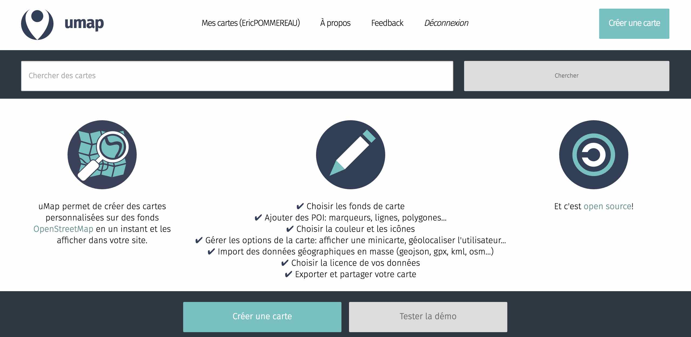
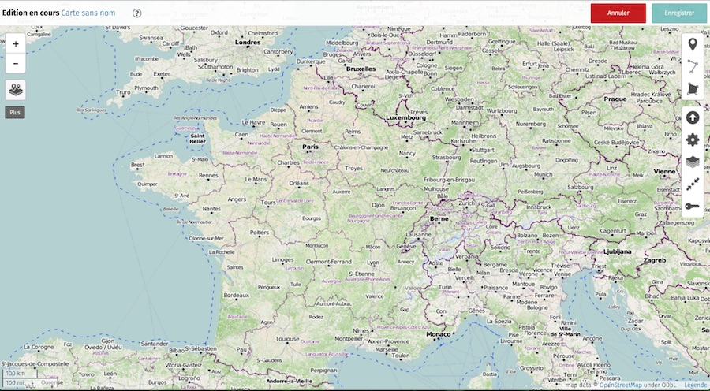
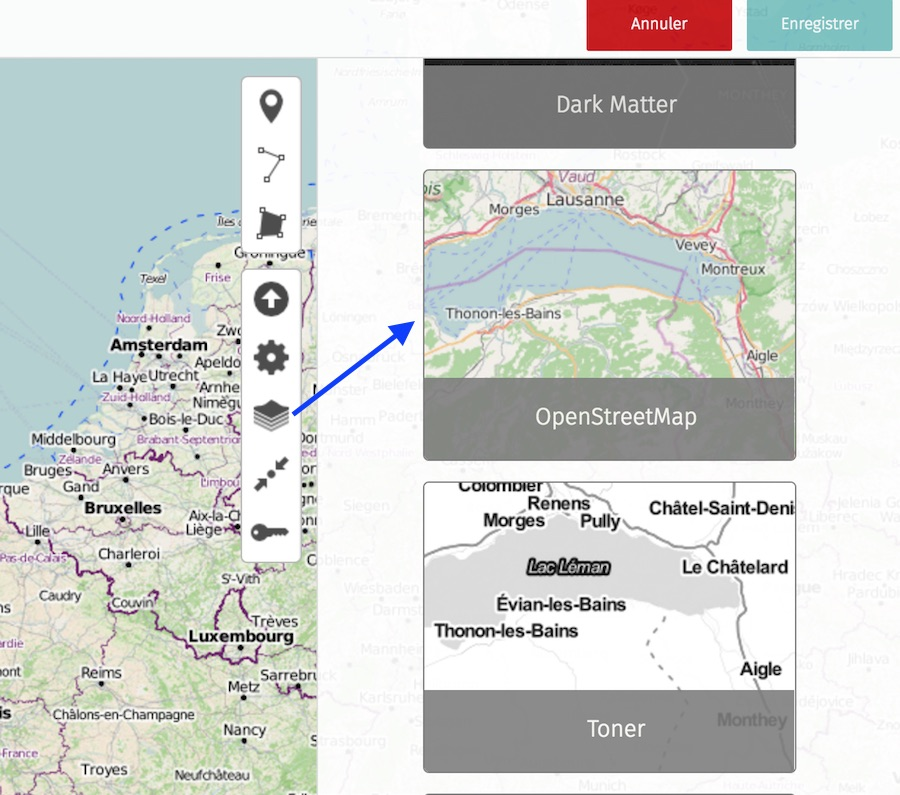
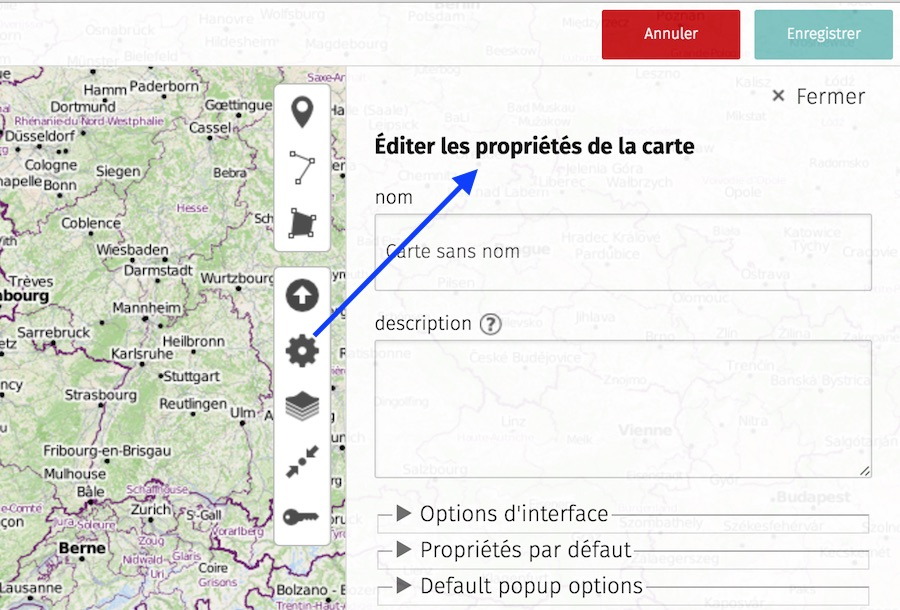
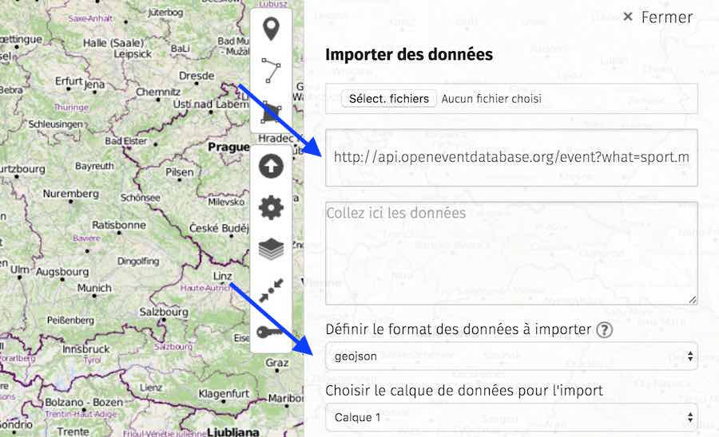
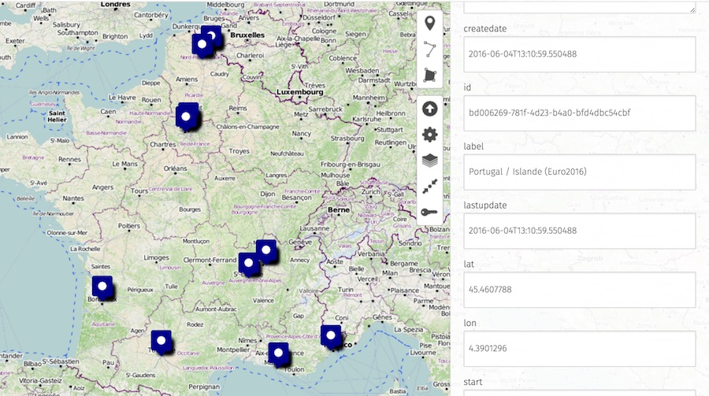
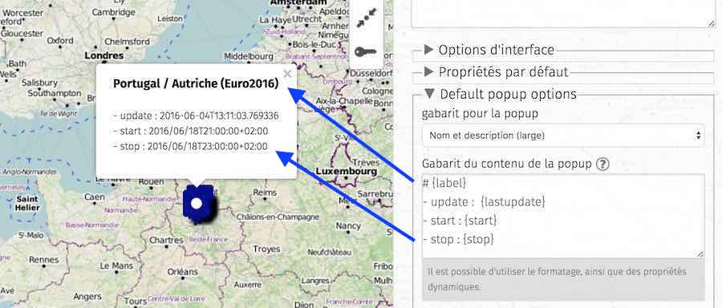

# Create OpenEventDB map with uMap

## Umap

>[Umap](http://umap.openstreetmap.fr) is an open source, WTFPL-licensed software. An instance of it lets you create a map with OpenStreetMap layers in a minute and embed them in your site. You can create custom maps (see the examples at the instances' front pages).

See documentation on openstreetmap wiki : http://wiki.openstreetmap.org/wiki/UMap

## A map with OpenEventDB datas

It's possible to create a map linked to OpenEventDatabase stream (datas)

### openning umap
Open [uMap](http://umap.openstreetmap.fr/fr/) and register, you can choose a provider (OpenStreetMap, GitHub, BitBucket or twitter at the moment).

### create a new map and quick settings
Click on "create a map"

Changing basemap : 

Editing properties : 

### adding OpenEventDB datas

Just let me take an exemple, soccer competition "euro 2016".

To generate the stream it's quiet simple, just with an URL : http://api.openeventdatabase.org/event?what=sport.match.soccer.euro2016&start=2016-06-10&stop=2016-07-14

URL defines 2 filters : 
- when : start=2016-06-10&stop=2016-07-14
- what : sport.match.soccer.euro2016

And define the format : geojson.

Click on "Import" and enjoy the result...

###Customize popups

Now we have events diplayed on map but no popup on click...

By default key "name" is default field diplayed in popup.

If you want to diplay another field (or more) you can do it by customizing popup options.

It's quiet simple key under brackets like {label} and you can also use markdown for formatting

Remember : you must desactivate edition to see result (allow click to popup)

###Creating a realtime layer

Last events

## Links 

Editing filters doc : https://github.com/openeventdatabase/backend/wiki

